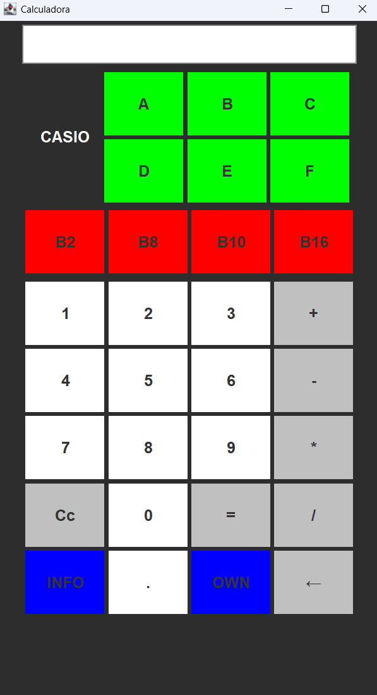

# Calculadora V2

## Descripción
Este proyecto consiste en el desarrollo de una calculadora con interfaz gráfica (GUI) en Java. La calculadora permite realizar las operaciones básicas de suma, resta, multiplicación y división, además de contar con funciones adicionales como borrar pantalla, borrar un número específico y agregar números decimales con un botón de coma.

## Características
- **Operaciones básicas**: 
  - Suma (+)
  - Resta (-)
  - Multiplicación (×)
  - División (÷)
  - Base Binaria
  - Base Octal
  - Base Decimal
  - Base Hexadecimal
- **Botones funcionales**:
  - Números del 0 al 9.
  - Letras Hexadecimal
  - Botón de coma para números decimales.
  - Botón para borrar la pantalla completa.
  - Botón para borrar el último número ingresado.
- **Interfaz gráfica**:
  - Diseño intuitivo y fácil de usar.

## Instrucciones de Instalación
1. Clona este repositorio:
   ```bash
   git clone https://github.com/usuario/calculadora-java.git

